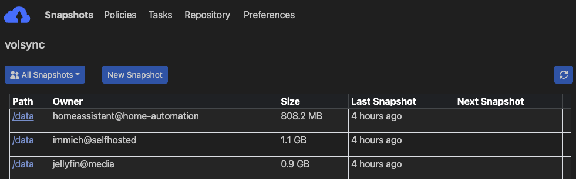
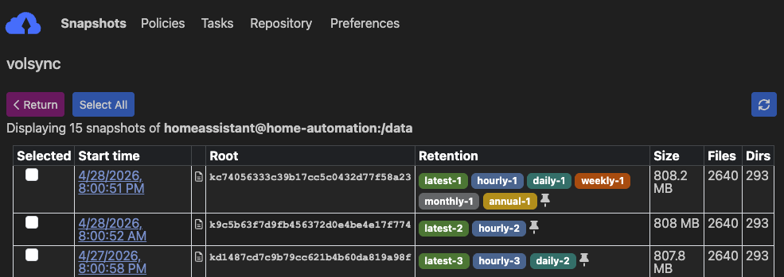

Have you ever had to reset your machine or move your whole Kubernetes cluster to a different machine? If yes then you know that having the whole configuration in code is only part of the setup, since most apps maintain state that is not represented as a Kubernetes resource that can be stored in code.

This guide will show how to run regular, encrypted backups for any Persistent Volumes in a Kubernetes cluster to your local NAS! The resources shown will be mostly generic, but parts of the setup work best on a Kubernetes cluster managed by FluxCD.

> [!NOTE]
> This guide is based on work from [onedr0p](https://github.com/onedr0p/) and [bjw-s](https://github.com/bjw-s/). OCI charts and images from [home-operations](https://github.com/home-operations) are used for all components!

## Prerequisites

The following resources have to be available in Kubernetes:

- NAS, or other external storage location attached via `nfs`/`smb` or similar
- Persistent volume backend with `VolumeSnapshot` functionality, e.g. [OpenEBS Local PV ZFS](https://github.com/openebs/zfs-localpv)

A `StorageClass` and a `VolumeSnapshotClass` resource have to exist in the cluster and be backed by a working `provisioner` and `driver` respectively. Names for both resources are relevant for later steps! You can verify volume snapshot functionality by checking the relevant resources exist.

```sh
kubectl get storageclass,volumesnapshotclass -o yaml
```

<details>
<summary>StorageClass and VolumeSnapshotClass resources</summary>

```yaml
apiVersion: storage.k8s.io/v1
kind: StorageClass
metadata:
  name: host-zfs # [!code highlight]
allowVolumeExpansion: true
parameters:
  compression: lz4
  dedup: "off"
  fstype: zfs
  poolname: zfspv-pool
  recordsize: 128k
  shared: "yes"
provisioner: zfs.csi.openebs.io
reclaimPolicy: Delete
volumeBindingMode: Immediate
```

```yaml
apiVersion: snapshot.storage.k8s.io/v1
kind: VolumeSnapshotClass
metadata:
  name: host-zfs-snapshot # [!code highlight]
driver: zfs.csi.openebs.io
deletionPolicy: Delete
```

</details>

In the following examples `host-zfs` will be used as `StorageClass` and `host-zfs-snapshot` as `VolumeSnapshotClass`. Depending on your Kubernetes configuration this may be different in your cluster!

## Setup

We'll set up each required resource one by one with a verification check for each step.

### 1. Initialize the repository

Install [kopia cli](https://kopia.io/docs/installation/#installing-kopia).
```sh
brew install kopia
```

Create a kopia repository in the directory you want to use for your backups by connecting to NAS from local device:
- `<NAS_PATH>` should be the directory used on the NAS
- `<PASSWORD>` should be a sufficiently complex password, e.g. generated using password manager

```sh
kopia repository create filesystem \
    --path="<NAS_PATH>" \
    --password="<PASSWORD>"
```

> [!TIP]
> The directory used on the NAS must be locally mounted and available under `<NAS_PATH>`. Remember to store `<PASSWORD>` as it must be reused to configure Kopia!

Output of the `kopia repository create` command should indicate success:
```sh
Initializing repository with:
  block hash:          BLAKE2B-256-128
  encryption:          AES256-GCM-HMAC-SHA256
  key derivation:      scrypt-65536-8-1
  splitter:            DYNAMIC-4M-BUZHASH
Connected to repository.
...
```

### 2. Deploy Kopia

Configure Kopia to use filesystem-based repository on NAS by using [app-template chart](https://bjw-s-labs.github.io/helm-charts/docs/app-template) with the following resources:
1. Secret with `<PASSWORD>` used to create Kopia repository
2. `OCIRepository` for `app-template` chart
3. `HelmRelease` to roll out kopia with correct `repository.config`

> [!WARNING]
> When committing this Secret (or any of the following) to Git, use [SOPS](https://fluxcd.io/flux/guides/mozilla-sops/), [External Secrets](https://external-secrets.io/latest/) or similar to obfuscate the credentials!

<details>
<summary>Minimal Flux resources to install Kopia</summary>

Secret with `<PASSWORD>` used to create kopia repository.
```yaml
apiVersion: v1
kind: Secret
metadata:
  name: kopia-secret
stringData:
  KOPIA_PASSWORD: <PASSWORD>
```

`OCIRepository` for `app-template` chart.
```yaml
apiVersion: source.toolkit.fluxcd.io/v1
kind: OCIRepository
metadata:
  name: kopia
spec:
  interval: 15m
  layerSelector:
    mediaType: application/vnd.cncf.helm.chart.content.v1.tar+gzip
    operation: copy
  ref:
    tag: 4.6.2
  url: oci://ghcr.io/bjw-s-labs/helm/app-template
```

`HelmRelease` to roll out Kopia with correct `repository.config`.
```yaml {24-36}
apiVersion: helm.toolkit.fluxcd.io/v2
kind: HelmRelease
metadata:
  name: kopia
spec:
  chartRef:
    kind: OCIRepository
    name: kopia
  interval: 30m
  values:
    controllers:
      kopia:
        containers:
          app:
            image:
              repository: ghcr.io/home-operations/kopia
              tag: 0.22.3
            envFrom:
              - secretRef:
                  name: kopia-secret
    
    configMaps:
      config:
        data:
          repository.config: |-
            {
              "storage": {
                "type": "filesystem",
                "config": {
                  "path": "/repository"
                }
              },
              "hostname": "volsync.<NAMESPACE>.svc.cluster.local",
              "username": "volsync",
              "description": "volsync",
              "enableActions": false
            }
    
    persistence:
      config-file:
        type: configMap
        identifier: config
        globalMounts:
          - path: /config/repository.config
            subPath: repository.config
      repository:
        type: nfs # [!code highlight]
        server: <NAS_HOSTNAME> # [!code highlight]
        path: <NAS_PATH> # [!code highlight]
        globalMounts:
          - path: /repository
```

`hostname` and `username` in the `repository.config` are going to be used by VolSync to access the repository and must be set accordingly. `enableActions` is explicitly set to `false` since [Kopia Actions](https://kopia.io/docs/advanced/actions/), i.e. commands/scripts to run before or after snapshot creation, are not needed in this setup.

</details>

Kopia pod exists and has a `repository` volume that allows access to the NAS. The `repository` volume must be the same NAS directory as configured in the previous step. It's made available in the container filesystem under `/repository`, with Kopia accessing the repository there using the matching password from the `KOPIA_PASSWORD` environment variable.

> [!TIP]
> Choose any namespace to install Kopia to, but make sure VolSync is installed in the same namespace for this configuration to work!

Shell into the Kopia pod and verify repository is detected correctly.

```sh
$ kopia repository status
Config file:         /config/repository.config

Description:         volsync
Hostname:            volsync.<NAMESPACE>.svc.cluster.local
Username:            volsync
Read-only:           false
Format blob cache:   15m0s

Storage type:        filesystem
Storage capacity:    12 TB
Storage available:   9.6 TB
Storage config:      {
                       "path": "/repository",
                       "dirShards": null
                     }
...
```

It's possible to [configure Kopia to serve a Web UI](#kopia-ui), which provides information on available apps and their snapshots.

### 3. Deploy VolSync

Install VolSync via the [app-template](https://bjw-s-labs.github.io/helm-charts/docs/app-template) chart and configure it to use the existing Kopia repository.

> [!NOTE]
> [backube/volsync](https://github.com/backube/volsync) does not support Kopia as a backend, so [perfectra1n/volsync](https://github.com/perfectra1n/volsync) fork is used.

<details>
<summary>Minimal Flux resources to install VolSync</summary>

`OCIRepository` for `volsync-perfectra1n` (OCI mirror) chart.
```yaml
apiVersion: source.toolkit.fluxcd.io/v1
kind: OCIRepository
metadata:
  name: volsync
spec:
  interval: 15m
  layerSelector:
    mediaType: application/vnd.cncf.helm.chart.content.v1.tar+gzip
    operation: copy
  ref:
    tag: 0.18.5
  url: oci://ghcr.io/home-operations/charts-mirror/volsync-perfectra1n
```

`HelmRelease` to roll out VolSync.
```yaml
apiVersion: helm.toolkit.fluxcd.io/v2
kind: HelmRelease
metadata:
  name: volsync
spec:
  chartRef:
    kind: OCIRepository
    name: volsync
  interval: 30m
  values:
    fullnameOverride: volsync # Required for volsync-perfectra1n fork [!code highlight]
    image: &image
      repository: ghcr.io/perfectra1n/volsync
      tag: v0.17.11
    kopia: *image
    rclone: *image
    restic: *image
    rsync: *image
    rsync-tls: *image
    syncthing: *image
    manageCRDs: true # [!code highlight]
    podSecurityContext:
      runAsNonRoot: true
      runAsUser: 1000
      runAsGroup: 1000
```

`fullnameOverride` ensures the chart's resources are named `volsync`/`volsync-*` instead of the auto-generated name, which the rest of this guide relies on! `manageCRDs` ensures the required CRDs are installed along with the rest of the chart. [YAML Anchors](https://helm.sh/docs/chart_template_guide/yaml_techniques/#yaml-anchors) are used to reuse the same section multiple times and reduce the number of lines that need to be changed when updating versions.

</details>

`volsync` deployment and pod should be running in the same namespace as Kopia with new CRDs now available in the cluster:
- `ReplicationSource`
- `ReplicationDestination`
- `KopiaMaintenance`

```sh
$ kubectl get crd | grep volsync.backube
kopiamaintenances.volsync.backube                         2026-02-12T16:59:19Z
replicationdestinations.volsync.backube                   2026-02-12T16:59:19Z
replicationsources.volsync.backube                        2026-02-12T16:59:19Z
```

### 4. Configure backups

Create a secret in the same namespace with the following contents, ensuring the `KOPIA_PASSWORD` is properly set.

```yaml
apiVersion: v1
kind: Secret
metadata:
  name: volsync-secret
stringData:
  KOPIA_REPOSITORY: filesystem:///mnt/repository
  KOPIA_PASSWORD: <PASSWORD>
```

The path in `KOPIA_REPOSITORY` will be used inside the mover pod to access the Kopia repository that will be made available on the local filesystem in the next step.

Choose an existing Persistent Volume Claim that should be backed up and remember its name. Then create a `ReplicationSource` referencing the PVC in `sourcePVC`. The previously created secret is referenced in `repository` so the Kopia repository can be accessed.

> [!TIP]
> Update `<NAS_HOSTNAME>` and `<NAS_PATH>` with correct values for your environment. If you are using something other than `nfs` make sure to update the whole volume section accordingly.

```yaml
apiVersion: volsync.backube/v1alpha1
kind: ReplicationSource
metadata:
  name: app
spec:
  sourcePVC: app-pvc # name of PVC # [!code highlight]
  trigger: # [!code highlight]
    schedule: 0 6 * * * # [!code highlight]
  kopia:
    accessModes:
      - ReadWriteOnce
    compression: zstd-fastest
    copyMethod: Snapshot
    moverSecurityContext:
      runAsUser: 1000
      runAsGroup: 1000
      fsGroup: 1000
    moverVolumes:
      - mountPath: repository
        volumeSource:
          nfs: # [!code highlight]
            server: <NAS_HOSTNAME> # [!code highlight]
            path: <NAS_PATH> # [!code highlight]
    parallelism: 2
    repository: volsync-secret # [!code highlight]
    retain:  # [!code highlight]
      daily: 1 # [!code highlight]
      weekly: 1 # [!code highlight]
      monthly: 1 # [!code highlight]
    storageClassName: host-zfs
    volumeSnapshotClassName: host-zfs-snapshot
```

This takes a snapshot of the PVC using the provided `VolumeSnapshotClass` and stores it in the Kopia repository on the NAS's filesystem. At this point a snapshot of the volume will be regularly stored in the Kopia repository, but we haven't yet configured anything to restore from them - that's covered in the next section.

`moverVolumes` adds extra volumes to the VolSync job's pods. `mountPath` specifies the path it's mounted in the pod, which is prefixed with `/mnt` by VolSync - `repository` therefore gets mounted to `/mnt/repository` in the VolSync jobs, matching the value of `KOPIA_REPOSITORY`. 

> [!TIP]
> `trigger.schedule` can be adjusted to a higher frequency depending on how often the backup should happen. In my own cluster a single daily backup, i.e. every day at 6:00 (`0 6 * * *`), is more than enough!
> 
> Depending on how many backups are done it may make sense to reduce how many of these are kept in the Kopia repository. This can be configured in the `retain` section and will mean any backups exceeding the limit will be discarded on the next [Kopia Maintenance](#6-run-maintenance) run, e.g. when doing hourly backups it may be enough to retain just 1 daily backup - all but the latest backup will be discarded.

You can check the logs of the last snapshot via the `ReplicationSource`'s Status section.

```yaml
status:
  conditions:
  - lastTransitionTime: "<TIMESTAMP>"
    message: Waiting for next scheduled synchronization
    reason: WaitingForSchedule
    status: "False"
    type: Synchronizing
  kopia: {}
  lastSyncDuration: 1m6.691241607s
  lastSyncTime: "<TIMESTAMP>"
  latestMoverStatus:
    logs: |-
      :/data
      - setting compression algorithm to zstd-fastest
      Compression policy applied successfully
      INFO: Creating snapshot for <APP>@<NAMESPACE>:/data
      INFO: Starting kopia snapshot creation...
      Snapshotting <APP>@<NAMESPACE>:/data ...
      
      | 0 hashing, 0 hashed (0 B), 1 cached (2 B), uploaded 0 B, estimating...
      / 1 hashing, 4 hashed (29 MB), 1964 cached (517.2 MB), uploaded 199 B, estimating...
      * 0 hashing, 6 hashed (30.3 MB), 1965 cached (517.2 MB), uploaded 199 B, estimating...
      Created snapshot with root <ID> and ID <ID> in 6s
      TIMING: Snapshot creation completed in 8 seconds
      INFO: Snapshot created successfully
      TIMING: Total backup operation took 8 seconds
      === Applying retention policy ===
      Setting policy for <APP>@<NAMESPACE>:/data
      - setting \"number of daily backups to keep\" to 7.
      Retention policy applied successfully
      INFO: === OPERATION SUMMARY ===
      INFO: OPERATION_TYPE: unknown
      INFO: OPERATION_RESULT: SUCCESS
      INFO: EXIT_CODE: 0
      INFO: === Done ===
```

This shows that the last sync was successful!

> [!TIP]
> If VolSync jobs fail due to missing Kopia repository access, check the logs of these pods. If it mentions `readonly directory` for the Kopia repository, verify the `KOPIA_REPOSITORY` value is set correctly for the app's VolSync secret.

### 5. Restore from backups

Now we'll set up restoration from the snapshots created by `ReplicationSource`.

Create a `ReplicationDestination` referencing the same secret in `repository` in [Configure Backups](#4-configure-backups), making sure to update `<NAS_HOSTNAME>` and `<NAS_PATH>` with the correct values for your environment.

```yaml
apiVersion: volsync.backube/v1alpha1
kind: ReplicationDestination
metadata:
  name: app-bootstrap
  labels:
    kustomize.toolkit.fluxcd.io/ssa: IfNotPresent
spec:
  trigger: # [!code highlight]
    manual: restore-once # [!code highlight]
  kopia:
    accessModes:
      - ReadWriteOnce
    capacity: 5Gi
    cleanupCachePVC: true
    cleanupTempPVC: true
    copyMethod: Snapshot
    enableFileDeletion: true
    moverSecurityContext:
      runAsUser: 1000
      runAsGroup: 1000
      fsGroup: 1000
    moverVolumes:
      - mountPath: repository
        volumeSource:
          nfs: # [!code highlight]
            server: <NAS_HOSTNAME> # [!code highlight]
            path: <NAS_PATH> # [!code highlight]
    repository: volsync-secret # [!code highlight]
    sourceIdentity: # [!code highlight]
      sourceName: app # [!code highlight]
    storageClassName: host-zfs
    volumeSnapshotClassName: host-zfs-snapshot
```

> [!NOTE]
> [Flux label](https://fluxcd.io/flux/components/kustomize/kustomizations/#ifnotpresent) `kustomize.toolkit.fluxcd.io/ssa: IfNotPresent` causes resources to only be created once and no longer updated. This is good to not revert any changes to `trigger.manual` and potentially do any unexpected restore, but it means any changes to these resources need to be manually applied!

The main identifier used by Kopia to match snapshots to apps is defined in `sourceIdentity`. `sourceName` must match the name of the corresponding `ReplicationSource`, which is combined with the namespace to create a unique identifier per app, e.g. `app@namespace`.

> [!TIP]
> `trigger.manual` can be any value. If it is updated then the PVC will be restored to the latest backup. It can be used to test correct behaviour, but does not otherwise need to be changed in any way.

Create a new PVC with `dataSourceRef` referencing the newly created `ReplicationDestination`. The `dataSourceRef` field is only honored at PVC creation when there's no existing volume and allows VolSync to load the latest snapshot and handle PV creation.

```yaml
apiVersion: v1
kind: PersistentVolumeClaim
metadata:
  name: app-pvc
spec:
  accessModes:
    - ReadWriteOnce
  dataSourceRef: # [!code highlight]
    kind: ReplicationDestination # [!code highlight]
    apiGroup: volsync.backube # [!code highlight]
    name: app-bootstrap # [!code highlight]
  resources:
    requests:
      storage: 5Gi
  storageClassName: host-zfs
```

> [!WARNING]
> PVC's `storage` and ReplicationDestination's `capacity` must be the same value, otherwise the volume cannot be populated.

If a backup exists the storage provider will wait for the volume to be restored from the latest snapshot before binding the PVC. The new PVC is populated with data from the most recent Kopia snapshot of the original PVC, located via the `ReplicationDestination`'s `sourceIdentity`.

You can check the Status section of the `ReplicationDestination` resource to see when the last sync happened:

```yaml
status:
  conditions:
  - lastTransitionTime: "<TIMESTAMP>"
    message: Waiting for manual trigger
    reason: WaitingForManual
    status: "False"
    type: Synchronizing
  kopia:
    requestedIdentity: app@<NAMESPACE>
  lastManualSync: restore-once
  lastSyncDuration: 18.253792789s
  lastSyncTime: "<TIMESTAMP>"
  latestImage:
    apiGroup: snapshot.storage.k8s.io
    kind: VolumeSnapshot
    name: volsync-app-bootstrap-dest-<TIMESTAMP>
  latestMoverStatus:
    logs: 'INFO: Snapshot restore completed successfully'
    result: Successful
```

According to the `latestMoverStatus` the snapshot was restored successfully.

### 6. Run Maintenance

Kopia requires regular maintenance jobs to clean up old snapshots. This is abstracted by using the `KopiaMaintenance` resource introduced by VolSync. It also requires a secret containing the necessary information to access the Kopia repository (similar to VolSync jobs).

```yaml
apiVersion: v1
kind: Secret
metadata:
  name: volsync-maintenance-secret
stringData:
  KOPIA_REPOSITORY: filesystem:///mnt/repository
  KOPIA_PASSWORD: <PASSWORD>
```

Create the `KopiaMaintenance` resource and make sure to update `<NAS_HOSTNAME>` and `<NAS_PATH>` with the correct values for your environment.

```yaml
apiVersion: volsync.backube/v1alpha1
kind: KopiaMaintenance
metadata:
  name: daily
spec:
  enabled: true
  trigger:
    schedule: 0 2 * * *
  moverVolumes:
    - mountPath: repository
      volumeSource:
        nfs: # [!code highlight]
          server: <NAS_HOSTNAME> # [!code highlight]
          path: <NAS_PATH> # [!code highlight]
  repository:
    repository: volsync-maintenance-secret
```

It creates a `CronJob` that creates the maintenance pod according to the schedule. You can check the `status` of the `KopiaMaintenance` resource to see when it last ran and when it's next scheduled.

```yaml
status:
  activeCronJob: kopia-maint-daily-37bf8193a6b69de2
  ...
  lastMaintenanceTime: "<TIMESTAMP>" # [!code highlight]
  lastReconcileTime: "<TIMESTAMP>"
  nextScheduledMaintenance: "<TIMESTAMP>" # [!code highlight]
```

## Summary

We've used [VolSync](https://volsync.readthedocs.io/en/stable/) to trigger snapshots, replicate storage and [Kopia](https://kopia.io/docs/) as backend for our snapshots:

1. Initialized Kopia repository on NAS from local machine
2. Installed Kopia in Kubernetes
3. Installed VolSync in Kubernetes
4. Configured PVCs to store snapshots in Kopia repository
5. Configured PVCs to load snapshots on creation or manual trigger
6. Added maintenance job to purge outdated snapshots from Kopia repository

> [!TIP]
> All resources can be found in [chrismuellner/home-ops](https://github.com/chrismuellner/home-ops) which manages my personal Kubernetes cluster!

A reusable workflow for adding these resources to new apps in an actual cluster is documented in [the next section](#reusable-component)!

## Bonus

What else is possible with this setup?

### Reusable component

Since this is a lot of resources that have to be created for each individual app and PVC that should be backed up, it's better to move this into a [Kustomize component](https://fluxcd.io/flux/components/kustomize/kustomizations/#components) that is then reused by Flux Kustomizations when needed.

Create a Kustomize `Component` with the following resources and parameterize name and size so it can be reused:

```yaml
apiVersion: kustomize.config.k8s.io/v1alpha1
kind: Component
resources:
  - ./volsync-secret.yaml
  - ./pvc.yaml
  - ./replicationdestination.yaml
  - ./replicationsource.yaml
```

<details>
<summary>Parameterized resources to use in component</summary>

Templated `Secret` to give each app the correct credentials. `KOPIA_PASSWORD` must be set the same as described in [Configure Backups](#4-configure-backups).
```yaml
apiVersion: v1
kind: Secret
metadata:
  name: ${APP}-volsync-secret
stringData:
  KOPIA_REPOSITORY: filesystem:///mnt/repository
  KOPIA_PASSWORD: <PASSWORD> # [!code highlight]
```

Templated `PersistentVolumeClaim` for use in the app.
```yaml
apiVersion: v1
kind: PersistentVolumeClaim
metadata:
  name: "${APP}"
spec:
  accessModes:
    - ReadWriteOnce
  dataSourceRef:
    kind: ReplicationDestination
    apiGroup: volsync.backube
    name: ${APP}-bootstrap
  resources:
    requests:
      storage: ${VOLSYNC_CAPACITY:=5Gi} # [!code highlight]
  storageClassName: host-zfs
```

Templated `ReplicationSource` to trigger backup for an app's PVC. `<NAS_HOSTNAME>` and `<NAS_PATH>` must be updated according to your environment, as done in [Configure Backups](#4-configure-backups).
```yaml
apiVersion: volsync.backube/v1alpha1
kind: ReplicationSource
metadata:
  name: ${APP}
spec:
  sourcePVC: "${APP}"
  trigger:
    schedule: 0 6 * * *
  kopia:
    accessModes:
      - ReadWriteOnce
    compression: zstd-fastest
    copyMethod: Snapshot
    moverSecurityContext:
      runAsUser: 1000
      runAsGroup: 1000
      fsGroup: 1000
    moverVolumes:
      - mountPath: repository
        volumeSource:
          nfs: # [!code highlight]
            server: <NAS_HOSTNAME> # [!code highlight]
            path: <NAS_PATH> # [!code highlight]
    parallelism: 2
    repository: ${APP}-volsync-secret
    retain:
      daily: 3
    storageClassName: host-zfs
    volumeSnapshotClassName: host-zfs-snapshot
```

Templated `ReplicationDestination` to restore an app's PVC in case of manual trigger or on a new machine.
```yaml
apiVersion: volsync.backube/v1alpha1
kind: ReplicationDestination
metadata:
  name: "${APP}-bootstrap"
  labels:
    kustomize.toolkit.fluxcd.io/ssa: IfNotPresent
spec:
  trigger:
    manual: restore-once
  kopia:
    accessModes:
      - ReadWriteOnce
    capacity: ${VOLSYNC_CAPACITY:=5Gi} # [!code highlight]
    cleanupCachePVC: true
    cleanupTempPVC: true
    copyMethod: Snapshot
    enableFileDeletion: true
    moverSecurityContext:
      runAsUser: 1000
      runAsGroup: 1000
      fsGroup: 1000
    moverVolumes:
      - mountPath: repository
        volumeSource:
          nfs:
            server: <NAS_HOSTNAME> # [!code highlight]
            path: <NAS_PATH> # [!code highlight]
    repository: ${APP}-volsync-secret
    sourceIdentity:
      sourceName: ${APP}
    storageClassName: host-zfs
    volumeSnapshotClassName: host-zfs-snapshot
```

</details>

This component can then be referenced in a Flux `Kustomization`. Using [post build variable substitution](https://fluxcd.io/flux/components/kustomize/kustomizations/#post-build-variable-substitution) the resources in the component can be created with unique names.

```yaml
apiVersion: kustomize.toolkit.fluxcd.io/v1
kind: Kustomization
metadata:
  name: example
spec:
  components: # [!code highlight]
    - ../../../../components/volsync # [!code highlight]
  interval: 10m
  path: ./kubernetes/apps/selfhosted/example/app
  postBuild: # [!code highlight]
    substitute: # [!code highlight]
      APP: example # [!code highlight]
      VOLSYNC_CAPACITY: 15Gi # [!code highlight]
  prune: true
  sourceRef:
    kind: GitRepository
    name: home-ops
  wait: true
  targetNamespace: selfhosted
```

The value of `APP` (in this case `example`) is used as the name of the PVC and can be referenced as such in the app's volumes. `VOLSYNC_CAPACITY` is optional and defaults to `5Gi` if left out. This default can be changed in the component, just make sure both `PersistentVolumeClaim` and `ReplicationDestination` are updated to the same value.

Path in `components` must be relative from the location of the `Kustomization` with the full directory structure looking similar to the following:

```
kubernetes
├── apps
│   ├── selfhosted
│   │   ├── example
│   │   │   ├── app
│   │   │   │   ├── helmrelease.yaml
│   │   │   │   ├── kustomization.yaml
│   │   │   │   └── ocirepository.yaml
└── components
    └── volsync
        ├── kustomization.yaml
        ├── pvc.yaml
        ├── replicationdestination.yaml
        ├── replicationsource.yaml
        └── volsync-secret.yaml
```

This means the following resources will be created in the `selfhosted` namespace:
- `PersistentVolumeClaim` called `example` backing a volume used in an app (not included here)
- `Secret` called `example-volsync-secret` containing Kopia repository credentials
- `ReplicationSource` called `example` storing a snapshot of the PVC with the same name 
- `ReplicationDestination` called `example-bootstrap` to restore PVC

### Kopia UI

Kopia provides a Web UI that can be used to easily check what snapshots are available for each app.



When navigating to a specific app, you can check what snapshots are available for it, when those were taken and how much storage they consumed on disk before compression by Kopia!



The following changes to the [Kopia installation](#2-deploy-kopia) enable the Web UI, assuming a working [Gateway API implementation](https://gateway-api.sigs.k8s.io/implementations/) is available in the cluster.

> [!TIP]
> Update `<DOMAIN>` with a correct value for your environment.

```diff
  values:
    controllers:
      kopia:
        containers:
          app:
            image:
              repository: ghcr.io/home-operations/kopia
              tag: 0.22.3
+            env:
+              KOPIA_WEB_ENABLED: true
+              KOPIA_WEB_PORT: &port 8080
            envFrom:
              - secretRef:
                  name: kopia-secret
+            args:
+              - --without-password

+    service:
+      app:
+        ports:
+          http:
+            port: *port

+    route:
+      app:
+        hostnames:
+          - kopia.<DOMAIN>
+        parentRefs:
+          - name: envoy-internal
+            namespace: network

    ...
```

The `--without-password` argument is passed to the Kopia container so the Web UI can be accessed without login.

### Moving apps to different namespaces

This setup enables easily moving apps from one namespace to another by leveraging the `sourceIdentity` field in the `ReplicationDestination`:
1. Ensure `ReplicationSource` has created a backup in the old namespace
2. Move app to new namespace with all resources and update `ReplicationDestination` to point to old namespace
```yaml
sourceIdentity:
  sourceName: app
  sourceNamespace: <OLD_NAMESPACE>
```
3. PVC in new namespace will be populated from existing backup, even though the identity no longer matches
4. Wait for `ReplicationSource` to create a new backup with the new identity
5. Update `ReplicationDestination` to remove reference to old namespace
```yaml
sourceIdentity:
  sourceName: app
```